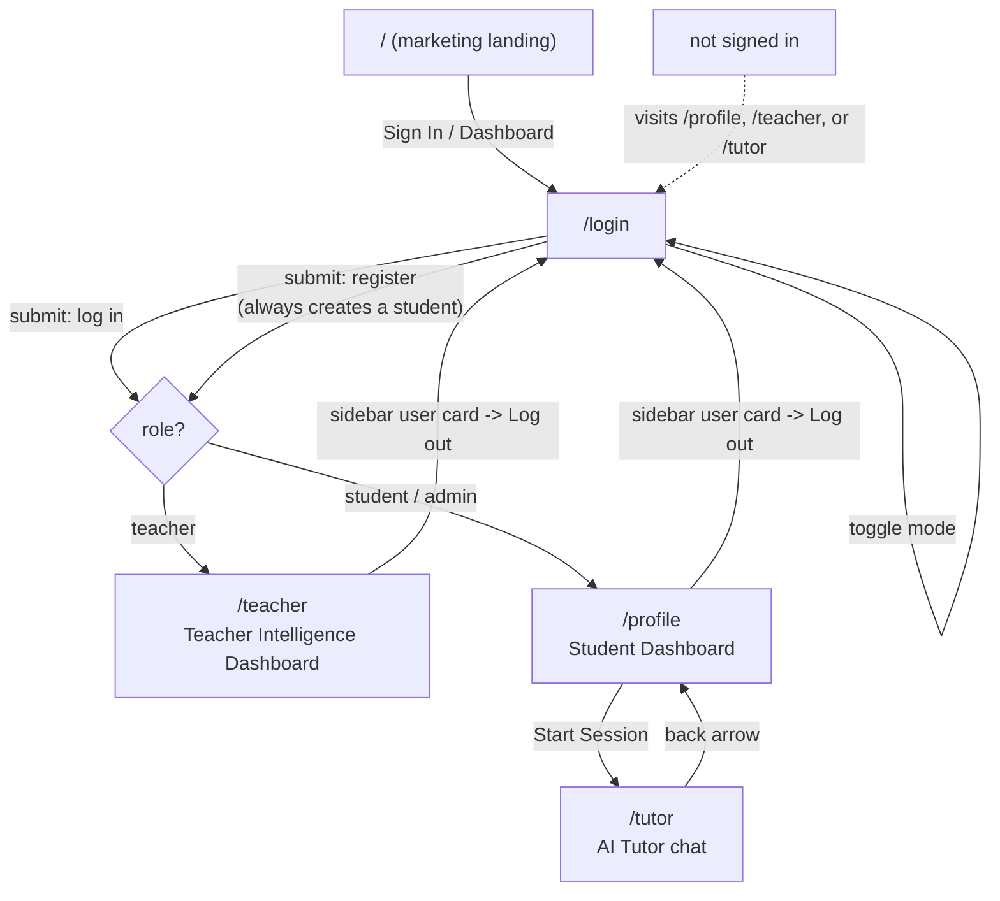

# Relearn

AI-powered learning platform: Socratic AI tutor for students, and a class
intelligence dashboard for teachers (at-risk alerts, material effectiveness,
AI usage transparency).

Frontend only — this repo talks to a separate backend at
[RelearnCorp/Backend-repository](https://github.com/RelearnCorp/Backend-repository)
over a REST API. Data on screen is a mix of real API data and mock/demo data
where the backend doesn't have an endpoint yet (see [Live vs. preview data](#live-vs-preview-data)).

## Tech stack

- [Next.js 16](https://nextjs.org) (App Router, Turbopack)
- React 19
- Tailwind CSS
- [Base UI](https://base-ui.com) for headless components (not Radix — see note below)

## Getting started

```bash
npm install
npm run dev
```

Open [http://localhost:3000](http://localhost:3000).

By default the app expects the backend at `http://localhost:3001`. Copy
`.env.example` to `.env.local` and adjust if it's running elsewhere:

```bash
cp .env.example .env.local
```

If the backend isn't running, the app still loads — dashboard cards fall
back to mock data and show a **"Preview data"** badge instead of crashing
(see below).

## Routes

| Route | Access | Description |
| --- | --- | --- |
| `/` | Public | Marketing landing page. |
| `/login` | Public | Sign in or register. Toggles between the two modes in place (no separate `/register` route). New accounts always start as `student`. |
| `/profile` | Student/teacher (signed in) | Student dashboard — course progress, misconception heatmap, recent activity, AI interaction style. |
| `/teacher` | Signed in | Teacher intelligence dashboard — class stats, at-risk students, AI transparency, material effectiveness. *(Reachable by anyone signed in; there's no role check yet that blocks a student from opening it directly — see [Known gaps](#known-gaps).)* |
| `/tutor` | Signed in | The AI tutor chat session (Socratic mode). |
| `/features` | Signed in | Internal capability showcase (Core LMS / AI Tutor / Teacher Analytics / Chatbot Buddy breakdown). **Not linked from any nav** — orphan page, direct-URL only. |

`/profile` and `/teacher` are Next.js *route groups* (`(dashboard)`,
`(marketing)`) — the parentheses don't appear in the URL.

### Auth guard

Tokens are stored in `localStorage`, not a cookie, so there's no session for
Next.js middleware to read on the edge. Route protection happens client-side
instead: `/profile`, `/teacher`, and `/tutor` are wrapped in an `AuthGuard`
component that checks for an access token on mount and redirects to
`/login` if there isn't one.

## App flow



Narrative version:

1. **`/`** — anyone lands here first. The navbar shows "Sign In" (or
   "Dashboard" if a session already exists in `localStorage`).
2. **`/login`** — one form, two modes (`Sign in` / `Create account`) toggled
   in place, no page navigation between them. Registering always creates a
   `student` account; there's no teacher sign-up flow yet.
3. On successful login/register, the app redirects by role:
   - `role.name === "teacher"` → **`/teacher`**
   - anything else (`student`, `admin`) → **`/profile`**
4. From **`/profile`**, the "Start Session" button under "AI Interaction
   Style" opens **`/tutor`**. The back arrow in the tutor header returns to
   `/profile`.
5. From either dashboard, clicking the user card at the bottom of the
   sidebar opens a menu with **Log out**, which clears the session and
   returns to `/login`.
6. Visiting `/profile`, `/teacher`, or `/tutor` without a session
   redirects straight to `/login`.

## Live vs. preview data

Several dashboard cards (Course Progress, Recent Activity, At-Risk
students, Material Effectiveness, AI Transparency, teacher stats) call the
backend on mount via `useLiveData`. If the call fails — backend down,
network error, endpoint not built yet — the card falls back to bundled
mock data and shows an amber **"Preview data"** badge instead of pretending
it's real. This is intentional: several backend endpoints don't exist yet
(e.g. per-student risk metrics), so the mock fallback is what makes the UI
demoable ahead of full API coverage.

## Known gaps

Left as-is intentionally rather than half-built; flagging for follow-up:

- **No role check on `/teacher`** — any signed-in user can open it directly
  by URL, not just teachers.
- **`/features` is unreachable from any nav** — direct-URL only.
- Several controls are visibly disabled with a "Coming soon" tooltip
  because there's no page/endpoint behind them yet: sidebar items other
  than the active one, Notifications, Sync Analytics, Generate Weekly
  Report, View All, Manage Files, Forgot password, DM.
- No `/courses/{id}` (or `/courses` list) page exists yet.
- The "Contact Us" button in the marketing navbar has no destination yet
  (no `href`/`onClick`) — a decorative CTA until there's a real contact
  mechanism to wire it to. The "About Us" nav link (`#about`) is also a
  dead anchor — no matching section exists on the homepage yet.
- This project's `Button` is [Base UI](https://base-ui.com), **not
  Radix** — use the `render` prop to compose it with `<Link>`, not
  `asChild` (which doesn't exist here and fails silently).
