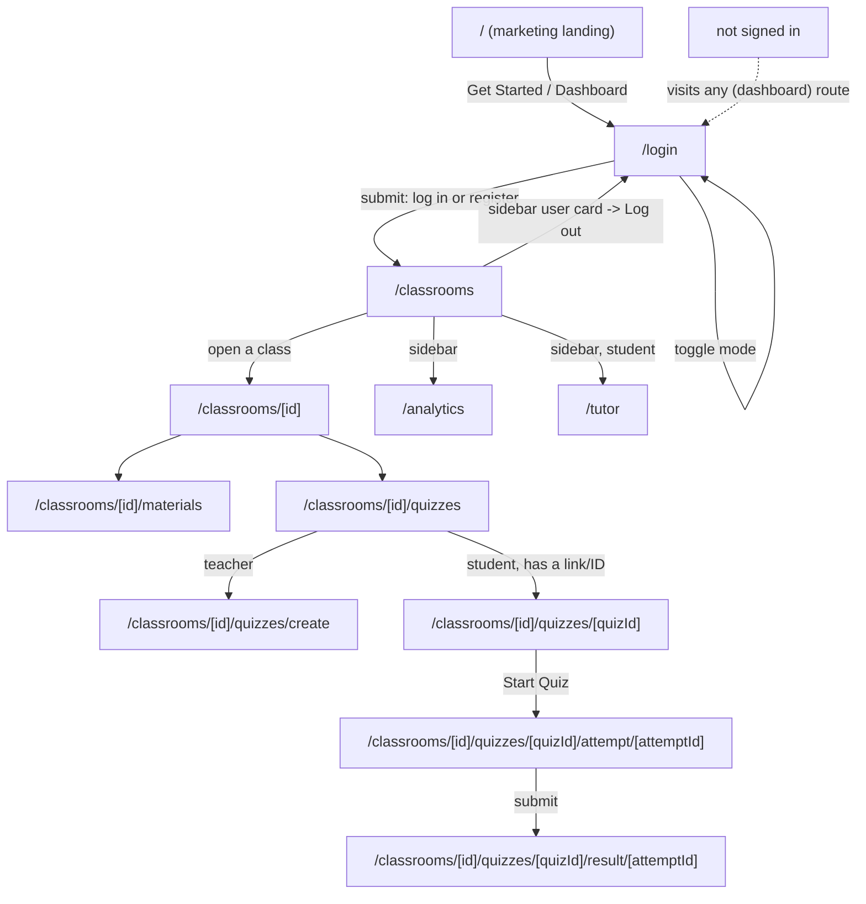

# Relearn

AI-powered LMS: teachers create classes, upload materials, and build
quizzes; students join with a class code, work through materials, take
quizzes with AI hints, and chat with a Socratic AI tutor.

Frontend only — this repo talks to a separate backend at
[RelearnCorp/Backend-repository](https://github.com/RelearnCorp/Backend-repository)
over a REST API. Every page on screen is backed by a real API call; there
is no mock/demo data fallback anywhere in the app (see
[Known gaps](#known-gaps) for the handful of things the backend doesn't
support yet).

## Tech stack

- [Next.js 16](https://nextjs.org) (App Router, Turbopack)
- React 19
- Tailwind CSS
- [Base UI](https://base-ui.com) for headless components (not Radix — see note below)
- [Zod](https://zod.dev) for form validation
- [Recharts](https://recharts.org) for the analytics charts

## Getting started

```bash
npm install
npm run dev
```

Open [http://localhost:3000](http://localhost:3000).

By default the app expects the backend at `http://localhost:3001`. Copy
`.env.example` to `.env.local` and adjust if it's running elsewhere (e.g.
a deployed backend URL):

```bash
cp .env.example .env.local
```

## Routes

| Route | Access | Description |
| --- | --- | --- |
| `/` | Public | Marketing landing page. |
| `/login` | Public | Sign in or register in place (no separate `/register` route). Registration includes a Student/Teacher toggle — see [Known gaps](#known-gaps), the backend doesn't honor it yet. |
| `/classrooms` | Signed in | List classes. Teacher: create a class. Student: join with a code. |
| `/classrooms/create` | Teacher only | Create-class form. |
| `/classrooms/enroll` | Student only | Join-by-code form. |
| `/classrooms/[classId]` | Signed in | Class detail — roster and class code (teacher), leave class (student). |
| `/classrooms/[classId]/materials` | Signed in | Upload material (teacher) / view materials (both). |
| `/classrooms/[classId]/quizzes` | Signed in | Quizzes hub — create-quiz link (teacher) or quiz-ID entry (student); see [Known gaps](#known-gaps) for why there's no quiz list. |
| `/classrooms/[classId]/quizzes/create` | Teacher only | Quiz builder — create quiz + add questions. |
| `/classrooms/[classId]/quizzes/[quizId]` | Signed in | Quiz hub — share link (teacher) or start quiz (student). |
| `/classrooms/[classId]/quizzes/[quizId]/attempt/[attemptId]` | Student only | Take the quiz, answer questions, request an AI hint per question. |
| `/classrooms/[classId]/quizzes/[quizId]/result/[attemptId]` | Student only | Result shown right after submitting. |
| `/analytics` | Signed in | Teacher: per-class quiz stats and AI usage breakdown. Student: overall progress and quiz history. |
| `/tutor` | Student only | Socratic AI tutor chat, scoped to a selected class's materials. |
| `/profile` | Signed in | Redirects to `/analytics`. |

`/classrooms/*`, `/analytics`, `/tutor`, and `/profile` all live under the
`(dashboard)` route group; `/` under `(marketing)`. The parentheses don't
appear in the URL.

### Auth guard

Tokens are stored in `localStorage`, not a cookie, so there's no session
for Next.js middleware to read on the edge. Route protection happens
client-side instead, via `AuthGuard`:

- Every route under `(dashboard)` requires a token (redirects to `/login`
  if missing) — wired once in `src/app/(dashboard)/layout.tsx`, which also
  renders the sidebar for every route.
- Single-purpose, single-role pages additionally pass `role="teacher"` or
  `role="student"` to `AuthGuard` (create class, enroll, create quiz, take
  quiz, `/tutor`) — the wrong role is redirected to `/classrooms` before
  the page renders, instead of only failing after a submit.

## App flow



1. **`/`** — anyone lands here first. The navbar shows "Get Started" (or
   "Dashboard" if a session already exists in `localStorage`).
2. **`/login`** — one form, two modes (`Sign in` / `Create account`)
   toggled in place. Registering shows a Student/Teacher toggle, but the
   backend currently always creates a `student` account regardless (see
   [Known gaps](#known-gaps)).
3. On successful login/register, everyone lands on **`/classrooms`** —
   the page itself branches by role (create-class vs. join-by-code, etc.),
   there's no separate per-role landing route anymore.
4. From a class, teachers manage materials/quizzes; students view
   materials and take quizzes. The sidebar (present on every dashboard
   route) links to `/classrooms`, `/analytics`, and — for students —
   `/tutor`.
5. Clicking the user card at the bottom of the sidebar opens a menu with
   **Log out**, which clears the session and returns to `/login`.
6. Visiting any `(dashboard)` route without a session redirects straight
   to `/login`; visiting a role-mismatched page redirects to `/classrooms`.

## Known gaps

These are backend limitations, not unfinished frontend work — the UI is
built and calls the real endpoint/shape the backend is expected to
support; it just can't be fully exercised until the backend catches up.

- **No teacher self-registration.** `POST /auth/register` always assigns
  the student role server-side (`getStudentRoleId()`), regardless of
  input. The registration form's Student/Teacher toggle already sends a
  `role` field — the backend's zod schema silently drops it today rather
  than rejecting the request, so this is a no-op until the backend reads
  and honors it. Until then, granting a teacher account means updating
  `users.role_id` directly in the database.
- **No endpoint to list a class's quizzes.** `getClassQuizzes()` exists
  unused in the backend's `lib/database/queries.ts`, but no route exposes
  it. The Quizzes tab can't show past quizzes — teachers get a shareable
  direct link after creating one instead, and students paste a quiz ID/link
  to start one.
- **No chat-session-creation endpoint.** `POST /ai/chat` requires an
  existing `chat_sessions` row and 404s (`SESSION_NOT_FOUND`) for a
  client-generated session id. `createChatSession()` exists unused in the
  backend; until a route creates one, `/tutor` shows the real error
  instead of a scripted fallback reply.
- **`/analytics` 500s.** `GET /analytics/progress` (and likely
  `/analytics/dashboard`, `/analytics/ai-usage`) fail — the backend's
  query code filters/selects `quiz_attempts.status`, `.percentage_score`,
  and `.completed_at`, but `lib/database/migrations.sql` only defines
  `started_at, submitted_at, score, learning_mode` on that table. Needs
  checking against the live schema; likely a migration to add the
  missing columns.
- **No password reset.** There's no backend endpoint for it, so there's
  no "Forgot password?" affordance in the UI either — removed rather than
  left as a disabled button.
- The footer's Privacy/Terms/Contact links (`#privacy`, `#terms`,
  `#contact`) are placeholder anchors — no corresponding sections exist
  yet.
- This project's `Button` is [Base UI](https://base-ui.com), **not
  Radix** — use the `render` prop to compose it with `<Link>`, not
  `asChild` (which doesn't exist here and fails silently).
